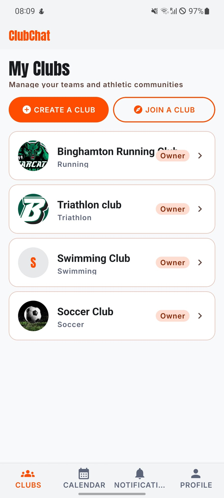
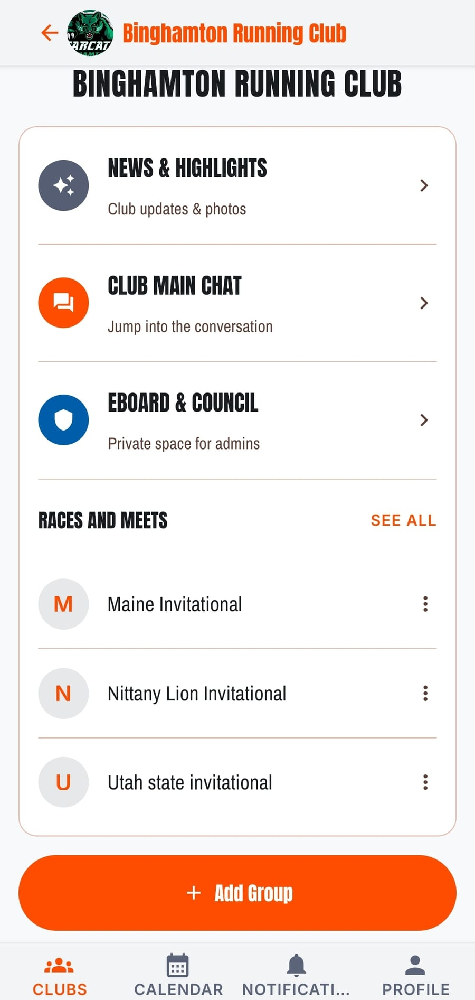
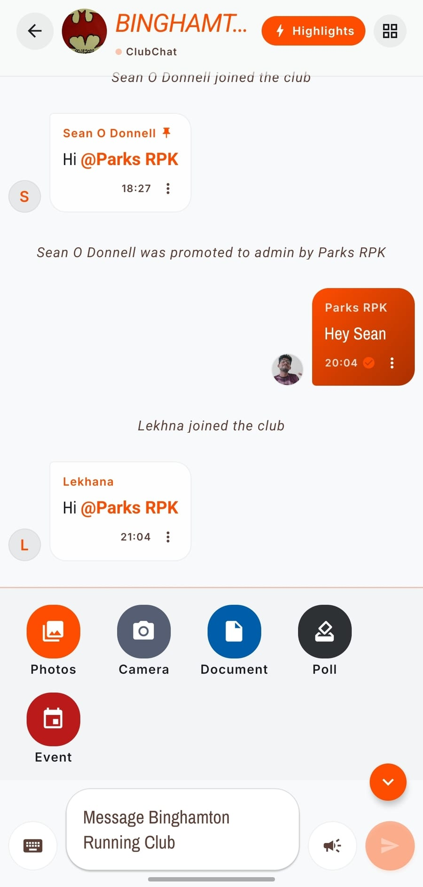
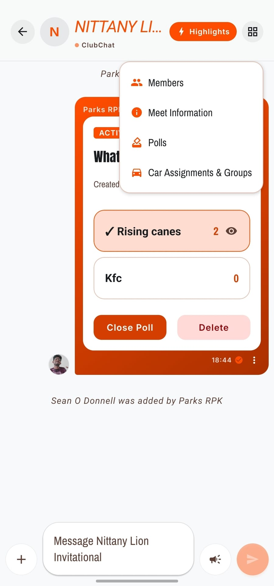
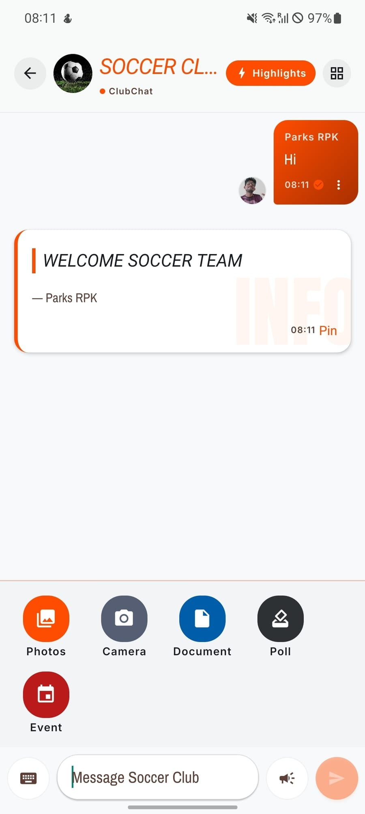
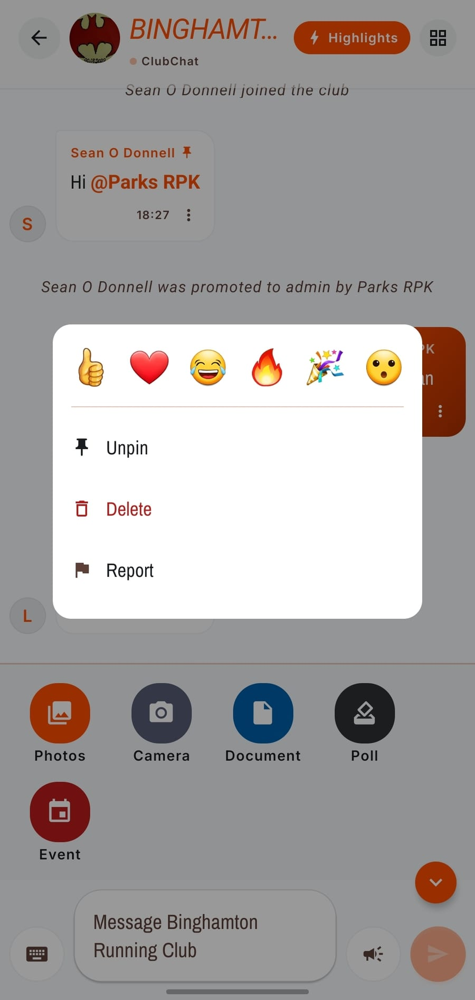
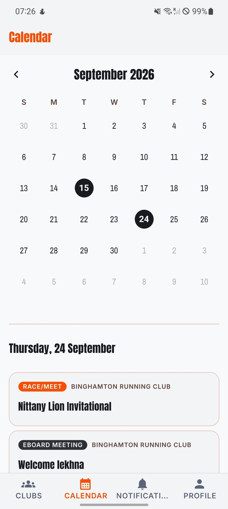
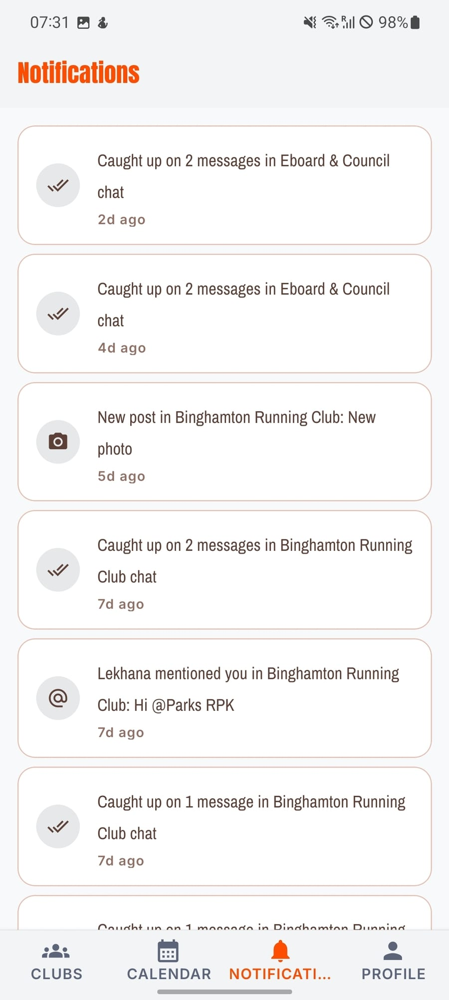

# ClubChat

**A coordination app for university sports clubs. Chat is the centre of gravity, and every
artifact a club currently fakes by hand becomes a first-class object with its own membership,
permissions and history.**

Built for my university running club, which coordinates roughly a hundred people through a
GroupMe thread and a lot of screenshots. Version 1 shipped and is in real use. This repository
is the remaster: a full rebuild driven by a written postmortem of v1's architecture.

`TypeScript` · `Node 24` · `Fastify` · `Postgres 17` · `Drizzle` · `Redis` · `WebSockets` ·
`React Native / Expo` · `S3-compatible object storage` · `APNs / FCM`

<table>
  <tr>
    <td width="33%"></td>
    <td width="33%"></td>
    <td width="33%"></td>
  </tr>
  <tr>
    <td valign="top"><sub><b>My Clubs.</b> Four clubs, one account, each with its own identity, its
      sport, and the role held in it. Avatars are the only media served from a public bucket, and a
      club without one falls back to its initial.</sub></td>
    <td valign="top"><sub><b>The club hub.</b> The three spaces a club owns, and its races nested one
      level down. This one screen is the whole product bet.</sub></td>
    <td valign="top"><sub><b>Club chat.</b> System messages and mentions in the durable log, with a tray
      that turns a poll or an event into a first-class object.</sub></td>
  </tr>
</table>

---

## Contents

- [Why I am building this](#why-i-am-building-this)
- [What it does](#what-it-does)
- [Inside the app](#inside-the-app)
- [At a glance](#at-a-glance)
- [Why there is a version 2: the v1 postmortem](#why-there-is-a-version-2-the-v1-postmortem)
- [Architecture](#architecture)
- [Seven decisions worth reading](#seven-decisions-worth-reading)
- [How it is verified](#how-it-is-verified)
- [Repository layout](#repository-layout)
- [Running it locally](#running-it-locally)
- [Status](#status)
- [The spec tree](#the-spec-tree)

---

## Why I am building this

My university running club runs itself out of a group chat. So does every other club on campus.
That works right up until you look at what people are actually doing inside it:

| What the club needs | What it does today | Why it breaks |
|---|---|---|
| A weekly workout plan | Written in Excel, screenshotted, pasted into chat, manually pinned | Not searchable, not dated, buried by chat volume within a day |
| Race logistics: carpools, meeting times, results | A brand new GroupMe group per race | Group sprawl, no roster continuity, dies the moment the race ends |
| Announcements | A normal message someone remembers to pin | Indistinguishable from chatter |
| A private captains / Eboard space | A second GroupMe group | Hand-maintained, and it drifts out of sync with who is actually an admin |
| A club calendar | Messages | Nothing is a date |

None of it is structured. It only works because members manually replicate structure the chat
app refuses to provide, and the Eboard absorbs that cost every single week.

**The product bet: give clubs the structure they are already faking by hand.** The pinned
workout screenshot, the per-race group chat, the admin side-group, the "who is driving" thread.
Each becomes a real object with real membership and real permissions.

The organising idea that makes this small instead of sprawling:

> **A Race is a Club nested one level down.** Same shape: membership, roster, chat, its own
> sub-features. Not a bespoke "event" screen. The admin-only Eboard space is that same shape
> again. Three scopes, one implementation, and direct messages later joined as a fourth.

And one rule that keeps permissions honest:

> **Access is earned per space, not inherited.** Being a club admin grants authority over a
> race. It does not grant membership of that race's chat. Management is not access, and the
> code is not allowed to confuse the two.

It is also deliberately built as a **template**. A swim club, a running club and a climbing club
should all fit with zero customisation work.

---

## What it does

**Clubs** with an owner, admins and members, joined by share link or by request, each with a
main chat, news and highlights, a calendar, polls, and weekly routines.

**Races and meets**, each a nested space with its own roster, its own chat, its own polls, and
car groups for who is driving whom.

**A private Eboard and Council space** per club, membership granted by promotion, with its own
chat, meetings and polls. Demotion takes it away, and the app says so.

**Chat** as the centre of gravity: a durable per-channel log, media and document attachments,
reactions, mentions, pinning, announcements, and cards that post themselves back into chat when
a poll or event or meeting is created elsewhere.

**Direct messages** between members who share a club, with blocking and a report queue shipped
in the same release, because adding a private surface without safety tooling is not shipping the
feature.

**Push notifications** to iOS and Android, suppressed by what you have actually read rather than
by whether a socket happened to be open.

iOS, Android and web from one Expo codebase, phone-first and portrait only.

---

## Inside the app

Six more screens, and the thing each one is really showing. All screenshots are the app running
on a physical Android device.

<table>
  <tr>
    <td width="50%"></td>
    <td width="50%"></td>
  </tr>
  <tr>
    <td valign="top">
      <b>A race, with its poll card</b><br />
      <sub>A poll created anywhere posts itself back into chat as a live card carrying its tally.
      <b>The card is a real row in the channel log</b>, written by the worker off the outbox rather
      than synthesised by the client, so it has a sequence number, survives a reinstall, and
      deleting the poll finds and removes the card instead of leaving a dead link. The overflow
      menu is what a nested space owns: its own roster, its own polls, and car groups for who is
      driving whom.</sub>
    </td>
    <td valign="top">
      <b>Announcements</b><br />
      <sub>Rendered differently because it <i>is</i> different. <b>A pin is reference and notifies
      nobody; an announcement is interruption and notifies everyone</b>, so they are two predicates
      rather than one flag. <code>canAnnounceInChannel</code> is admin-only and constant-false in a
      DM, where nobody holds that authority over anybody. Keeping them separate is what lets pin
      stay available to both participants in a DM without handing either one a megaphone.</sub>
    </td>
  </tr>
  <tr>
    <td width="50%"></td>
    <td width="50%"></td>
  </tr>
  <tr>
    <td valign="top">
      <b>Message actions</b><br />
      <sub><b>Which entries this sheet offers is a policy question, not a UI one.</b> Delete is
      the sender or a space admin; pin is admin in a club but <i>either participant</i> in a DM,
      because a pin is reference and an announcement is interruption; report is gated on
      membership rather than on the ability to post, so a member who has just blocked someone can
      still report what was said to them. <code>canDeleteOthersMessages</code> exists as its own
      named predicate precisely so this screen can decide whether to draw "Delete" without
      shipping raw admin-ness to the client.</sub>
    </td>
    <td valign="top">
      <b>Calendar</b><br />
      <sub>Every scope a member can see, merged into one month and tagged with both the club it
      came from and the kind of thing it is. <b>There is deliberately no calendar table</b>: a
      second copy would drift, whereas a merged read cannot go stale. The merge is
      permission-shaped, so an Eboard meeting appears only for Eboard members and two people in
      the same club see different months. Races are the deliberate exception, visible to every
      member, because you cannot ask to join a race you cannot see.</sub>
    </td>
  </tr>
  <tr>
    <td width="50%"></td>
    <td width="50%"></td>
  </tr>
  <tr>
    <td valign="top">
      <b>Notifications</b><br />
      <sub>Every row is stored as a <b>type plus structured params</b> and rendered on the client,
      never as a pre-rendered string and a saved route
      (<a href="SPEC/decisions/0013-notifications-store-type-and-params.md">ADR-0013</a>): renaming
      a club fixes the history instead of leaving it stale. "Caught up on 2 messages" is the read
      cursor talking, and it is the same cursor that decides whether a push was ever sent.</sub>
    </td>
    <td valign="top">
      <b>Profile</b><br />
      <sub>Club memberships carry their role, because role is the input to every authorization
      question in the system. It is also a privacy surface: <b>date of birth is withheld when
      another member views this profile</b>, and the surface gate asserts that explicitly rather
      than trusting the serializer. Deleting an account anonymises it and blocks future sign-in
      <i>without</i> removing content, so club history stays readable with the person redacted
      out of it.</sub>
    </td>
  </tr>
</table>

---

## At a glance

| | |
|---|---|
| **Language** | TypeScript throughout, strict, no `any` escape hatches in the domain layer |
| **Runtime** | Node 24, npm workspaces monorepo, three server entrypoints (API, gateway, worker) |
| **Data** | Postgres 17 via Drizzle, **39 tables**, **14 migrations**, invariants enforced as constraints rather than in handlers |
| **HTTP surface** | **116 routes** across 12 route modules on Fastify |
| **Realtime** | WebSocket gateway, Redis pub/sub per channel topic, gapless per-channel sequence numbers |
| **Async** | Transactional outbox drained with `FOR UPDATE SKIP LOCKED`, with Kafka specified downstream |
| **Client** | React Native / Expo, expo-router, local SQLite message cache, send outbox, sync engine |
| **Tests** | **631 passing** across 19 files, real Postgres and Redis per suite via Testcontainers |
| **Code** | ~46,000 lines of TypeScript across server, shared protocol, client core and the app |
| **Documentation** | 19 product docs, 18 technical docs, **17 architecture decision records** |

---

## Why there is a version 2: the v1 postmortem

[Version 1](https://github.com/parks3131/ClubChat) shipped and is used. It was built the fast
way: managed Postgres with row-level security, the client talking to the database directly, and
domain logic in database triggers. It worked, and then it accumulated a very specific set of
defects.

The remaster exists because I wrote those defects down and found they were not independent.
Almost every one of them has the same root cause: **the database was the application server.**

| Symptom in v1 | Root cause |
|---|---|
| Create-and-return needs a *read* rule covering the row you just wrote | Authorization expressed as row-level predicates rather than a function call |
| A read rule must never re-query its own table | Same |
| "Admin" checks must also match Owner. Shipped wrong **four separate times** | The predicate was copy-pasted per policy instead of existing once |
| Row-level rules cannot express column-level authority | Same |
| Bootstrap trigger ordering matters and is invisible | Domain effects as database triggers, so ordering is implicit and untestable |
| Unfiltered subscriptions: every user received every row | Realtime bound to table changes rather than to domain events with an audience |
| No replay after disconnect. A backgrounded phone silently lost messages | No sequence numbers, so "what did I miss" was unanswerable |
| Retries could double-post | No client-generated idempotency key |
| No push notifications at all, the single biggest functional gap | No server to fan out from |

Every row above is fixed by the same two moves: **put a real application server in the middle**,
and **give the message log a monotonic sequence number.**

Two things I made a point of writing down so they do not get re-litigated:

- **The problem was never "a vendor did the heavy lifting."** Managed Postgres, managed object
  storage and a managed auth provider are all still good ideas. The problem was that
  *authorization and domain logic lived in the database* and *the client talked to the database
  directly.* That specific thing is what ends.
- **This is more code than v1.** That is the trade, and it is deliberate. In exchange the
  permission matrix becomes unit-testable, effects become ordered and replayable, and "what did
  I miss" becomes a single integer comparison.

There is a matching honesty exercise on scale. ClubChat targets 50,000 users, 3,000 peak
concurrent connections and 200,000 messages a day. That is four to five orders of magnitude
below the systems whose designs get copied into projects like this, so Cassandra, sharding and
multi-region are all explicitly declined in
[`SPEC/TECH/00-overview.md`](SPEC/TECH/00-overview.md). The rule instead is:

> **Build the seams, not the scale.** Every component we are not building has a named interface
> in the code (`MessageBus`, `ConnectionRegistry`, `MediaStore`, `PushSender`), so the swap is a
> new implementation of an existing port rather than a rewrite.

---

## Architecture

```
┌─────────────────────────────────────────────────────────────────┐
│  CLIENTS - Expo app (iOS / Android / Web)                       │
│  · local SQLite message cache, keyed by (channel_id, seq)       │
│  · send outbox with client-generated message ids                │
│  · sync engine: reconnect / foreground -> "since_seq"           │
└───────────────┬──────────────────────────┬──────────────────────┘
                │ WebSocket (realtime)     │ HTTPS (everything else)
                ▼                          ▼
    ┌───────────────────────┐   ┌───────────────────────────────┐
    │  GATEWAY              │   │  API                          │
    │  · WS termination     │   │  · 116 REST routes            │
    │  · auth handshake     │   │  · chat history + sync reads  │
    │  · subscribe, authed  │   │  · every command handler      │
    │    once at subscribe  │   │    writes domain + outbox     │
    │  · fan-out to sockets │   │    in ONE transaction         │
    └───────┬───────────────┘   └───────────┬───────────────────┘
            │                               │
            │   ┌───────────────────────────┴──────────┐
            │   │  POLICY MODULE (shared, in-process)  │
            │   │  every authorization predicate,      │
            │   │  defined once and nowhere else       │
            │   └───────────────────────────┬──────────┘
            ▼                               ▼
    ┌───────────────┐              ┌──────────────────┐
    │  REDIS        │◄─────────────┤  POSTGRES        │
    │  · connection │   pub/sub    │  · domain tables │
    │    registry   │   per-channel│  · channel log   │
    │  · rate limit │   topics     │    with seq      │
    │    buckets    │              │  · outbox        │
    └───────────────┘              └────────┬─────────┘
                                            │ drained every 250ms
                                            ▼
                                   ┌──────────────────┐
                                   │  WORKER          │
                                   │  · system msgs   │  every server-side
                                   │  · chat cards    │  effect lives here,
                                   │  · notif fan-out │  and nowhere else
                                   │  · push send     │
                                   │  · cascades      │
                                   │  · media derive  │
                                   └────────┬─────────┘
                          ┌─────────────────┼──────────────┐
                          ▼                 ▼              ▼
                   ┌────────────┐   ┌────────────┐  ┌────────────┐
                   │ OBJECT     │──▶│ CDN        │  │ EXPO PUSH  │
                   │ STORAGE    │   │            │  │ → APNs/FCM │
                   └────────────┘   └────────────┘  └────────────┘
```

Gateway, API and worker are three **roles**, not necessarily three deployables. They are one
codebase with three entrypoints, and the boundary that matters is the code boundary, so
splitting them later is a deploy change rather than a refactor.

The gateway owns WebSocket connections and nothing durable. Its defining property, checked
against every change to that file:

> **A gateway can be killed at any instant with zero data loss.** Everything it knows is
> reconstructible by a client reconnecting, because nothing is acknowledged before it is
> durable and nothing durable is ever only in a gateway's memory.

---

## Seven decisions worth reading

Each of these has an ADR in [`SPEC/decisions/`](SPEC/decisions/) recording the rejected
alternative and why, so it does not get argued about twice.

### 1. A durable channel log, not store-and-forward

WhatsApp treats the server as a relay and deletes a message once every device acknowledges it.
ClubChat's entire product bet is the opposite: durable, revisitable history *is* the value. So
the storage model inverts.

| | WhatsApp | ClubChat |
|---|---|---|
| Authoritative store | The recipient's device | **The server's channel log** |
| Per-recipient copy | One inbox row per recipient | **One row per message, ever** |
| "What did I miss?" | Replay my undelivered inbox | **`SELECT ... WHERE seq > my_cursor`** |

Every channel carries `last_seq`, and every message takes `seq = last_seq + 1` allocated inside
the insert transaction. Not a Postgres `SEQUENCE`, which is non-transactional and would leave
holes on rollback. The result is **gapless and strictly ordered per channel**, which makes
paging, sync and gap detection into integer comparisons.

That transaction carries an invariant that is invisible at the call site, so it is written down
in large letters:

> **The sequence-allocating transaction performs no I/O.** The `UPDATE channels SET last_seq =
> last_seq + 1` takes a row lock held until commit, serializing every send to that channel. No
> network call, object-storage `HEAD`, push dispatch or external HTTP may ever appear inside it.

A well-meaning "let us just verify the attachment exists before we commit" is precisely the
change that would serialize an entire club's chat behind a network round trip. Attachments are
therefore validated at `/media/:id/complete`, *before* the message referencing them is sent.

[`packages/server/src/domain/append-message.ts`](packages/server/src/domain/append-message.ts) ·
[ADR-0003](SPEC/decisions/0003-durable-channel-log-not-store-and-forward.md)

### 2. Authorization is one module, and predicates exist exactly once

The v1 defect that shipped four times was "admin" checks that failed to match Owner, which
silently excluded every brand-new club, because the predicate was copy-pasted per policy. In
the remaster it exists once, with the bug's history in the comment so nobody re-flattens it:

```ts
/**
 * The admin tier, and the single most important line in this file.
 *
 * Owner is a strict superset of Admin, so this must match BOTH. A check for "admin"
 * alone silently excludes a club whose only admin-tier member is the Owner - which
 * is every brand-new club. That exact bug shipped four separate times in v1 [...]
 * It now exists once.
 */
export const isClubAdmin = (ctx: AccessContext, clubId: string): boolean => {
  const role = ctx.clubRole.get(clubId);
  return role !== undefined && ADMIN_TIER.includes(role);
};
```

Every command handler follows the same three steps: load an access context, ask the policy
module, then write domain rows and outbox events in one transaction. **No handler may re-derive
a predicate inline, ever.** The separation that the product principle demands is enforced right
there in the read path:

> The race branch consults the roster set and **not** club-admin status. Management authority is
> not access: a club admin may manage every race in the club and still have no right to open its
> chat.

Because the predicates are plain functions over an in-memory context, the entire permission
matrix is a unit test rather than an integration exercise against a live database.

[`packages/server/src/policy/predicates.ts`](packages/server/src/policy/predicates.ts) ·
[ADR-0002](SPEC/decisions/0002-application-server-not-database-as-backend.md)

### 3. A transactional outbox, with Kafka downstream and never instead

Domain writes and their side effects commit together, in the same transaction, into an `outbox`
table. A drain claims rows with `FOR UPDATE SKIP LOCKED` every 250ms and dispatches them to the
worker, which owns every server-side effect: system messages, chat cards, notification fan-out,
push sends, membership cascades, media derivation.

Deliberate choices in that loop:

- **Polling, not `LISTEN`/`NOTIFY`.** `LISTEN` needs a session pinned for the listener's
  lifetime, which is incompatible with transaction-mode connection pooling and would rule out
  serverless Postgres.
- **At-least-once delivery, made safe by idempotency.** Server-authored messages derive their
  `client_msg_id` deterministically from the outbox event id, so a redelivery collides with a
  unique index instead of posting "X joined the club" twice.
- **Parked rows are never deleted.** After five attempts a row stops retrying but stays, because
  a stuck event means notifications have silently stopped for that partition. That is the kind
  of failure nobody notices until somebody complains that a club chat "went quiet".
- **Kafka sits downstream of the outbox, never in place of it.** The outbox stays the
  transactional boundary. Because the outbox already works without Kafka, the decision to add it
  has a cheap exit ramp, which is written into the ADR.

[`packages/server/src/worker/drain.ts`](packages/server/src/worker/drain.ts) ·
[ADR-0006](SPEC/decisions/0006-kafka-downstream-of-the-outbox.md)

### 4. Push is suppressed by the read cursor, never by connection liveness

The obvious implementation is "do not push if their socket is open." It is also wrong, and this
is a correctness bug rather than an optimisation:

> `last_read_seq >= N` is a fact committed to Postgres: this member demonstrably saw the
> message. A live socket is proof of nothing. A phone that dies, loses signal or is force-quit
> leaves a registry entry alive until its TTL expires, and gating push on that entry silently
> swallows every notification in the window.

So the push module never touches Redis at all. **Liveness may only ever accelerate delivery; it
may never suppress it.**

Dispatch is then deferred by 8 seconds, which exists to *lose* a race rather than to save work:
a member with the chat already open advances their cursor within a few hundred milliseconds, and
the cursor is re-read at evaluation time rather than captured when the event was enqueued.
Capturing it early would defeat the entire point of waiting.

[`packages/server/src/push/dispatch.ts`](packages/server/src/push/dispatch.ts) ·
[ADR-0008](SPEC/decisions/0008-push-suppression-by-read-cursor.md)

### 5. The server never touches file bytes

Clients `PUT` directly to object storage against a presigned URL. The server's job is issuing
that URL and then verifying, with a `HEAD`, that what arrived matches what was declared. That is
why the `MediaStore` port has no `upload` method taking a buffer.

Storage is split into two buckets and the split is load-bearing: identity media such as avatars
is public with a stable path, while **content media such as chat photos and documents is private
and only ever reachable through the authorized redirect at `GET /media/:id`.** Signed URLs are
hour-aligned so they cache, and they are signed with a secret distinct from the auth secret, so
a leak of one is not a leak of the other.

Locally this runs against MinIO rather than a hand-written fake, because the presigned-`PUT`
flow and the `HEAD` verification are exactly the parts that pass against a fake and fail against
a real bucket. Production is Cloudflare R2, chosen for zero egress, since media egress is the
dominant variable cost.

[`packages/server/src/media/store.ts`](packages/server/src/media/store.ts) ·
[`SPEC/TECH/07-media-pipeline.md`](SPEC/TECH/07-media-pipeline.md)

### 6. The client assumes the network is hostile

The sync engine lives in `packages/client-core`, written once and shared by the Expo app and the
Phase 0 exit drill, so the drill exercises the code that actually ships rather than a convenient
stand-in. Two rules drive its design:

1. **Realtime is an enhancement, not a requirement.** The socket is an accelerator. Every screen
   can also load over REST, so a dropped connection degrades to stale-until-refresh rather than
   broken.
2. **The gap rule applies to the `ack` path, not only to `msg.new`.** Skipping the check when a
   send is acknowledged leaves a permanent, silent hole in the local log.

Sends go through a client-side outbox keyed by a client-generated message id, which the server's
unique index turns into free deduplication. A retry that resolves to the original message is
reported as success, and that is exactly what makes the outbox safe to retry aggressively.

[`packages/client-core/src/chat-client.ts`](packages/client-core/src/chat-client.ts) ·
[ADR-0012](SPEC/decisions/0012-no-receipts-presence-or-typing-indicators.md)

### 7. Direct messages arrived with their safety tooling, not after it

DMs were a non-goal in v1 on the reasoning that every conversation is scoped to a club, a race or
an Eboard. Reversing that decision in the remaster came with an explicit obligation recorded in
the same document:

> The reversal carries an obligation: it moves member blocking and a report destination from
> "important, not blocking" into the same release as the feature.

So `member_blocks`, `message_reports` and a moderator-gated report queue shipped alongside DMs.
Blocking also forced a distinction that had been hiding: **read access and post access had been
the same question until DMs existed**, and they had to separate, because a blocked participant
still reads the history they were part of. `canReadChannel` and `canPostInChannel` are now
different predicates for that reason.

[`packages/server/src/domain/moderation.ts`](packages/server/src/domain/moderation.ts) ·
[ADR-0009](SPEC/decisions/0009-direct-messages-as-fourth-channel-scope.md)

---

## How it is verified

Four layers, each catching something the layer below cannot.

**1. Types.** `npm run typecheck` across all four workspaces. Clean.

**2. Tests: 631 passing across 19 files.** `npm test`

```
 @clubchat/client-core   1 file    17 tests   passed
 @clubchat/server       16 files  589 tests   passed   (41s)
 @clubchat/shared        2 files   25 tests   passed
```

Handler tests run against a **disposable Postgres and Redis started per suite with
Testcontainers**, and they run the **real migrations** rather than a hand-written `CREATE TABLE`.
That is the point: a migration that fails to carry an invariant fails the suite instead of
passing against a convenient schema. It is also the standing rule that no destructive command
touches a database that has not been confirmed disposable, and a container is disposable by
construction.

The permission matrix is a table-driven suite covering every cell of role by scope by action,
which is why 405 written cases expand to 589 executed ones.

**3. Constraint proof: `npm run db:prove`.** A SQL harness that *attempts to violate every domain
invariant* and asserts the database rejects it, then rolls back.

```sql
-- Reaching here means the statement was ACCEPTED, so the constraint is absent
-- or does not cover this case. That is the defect this file exists to catch.
RAISE EXCEPTION 'FAIL  constraint did not fire: %', label;
```

Reading the DDL and concluding it looks right is not verification. A partial unique index with a
slightly wrong `WHERE` clause, or a unique index containing a nullable column, both look correct
and enforce nothing. This harness fails loudly in the one direction that matters, and a silent
pass is the single outcome it must never produce.

**4. Surface gate: `npm run gate:surface`.** 73 checks that call every route against a **running
server over TCP**, through the real HTTP stack, against real Postgres, exactly as a client will.

This exists because of a lesson worth keeping. An earlier phase's exit gate was "the permission
matrix suite covers every cell", which a domain layer with no HTTP surface at all satisfies
perfectly, and did, for two phases: 32 command handlers with no route to reach them. So the next
gate was deliberately made into something `npm test` cannot satisfy.

**The refusals in that gate matter as much as the successes**: a member attempting a pin, a club
admin with no roster row reaching for race chat, a race poll requested by direct URL. A failure
on one of those reads "this refusal did not happen."

```bash
npm run verify   # typecheck + runtime parse + lint + the full suite
```

---

## Repository layout

```
ClubChat-Remastered/
├── apps/
│   └── mobile/                  Expo app: iOS, Android, web from one codebase
│       ├── app/                 expo-router file routes (~41 screens)
│       └── src/                 chat provider, API client, SQLite store, design tokens
├── packages/
│   ├── server/
│   │   └── src/
│   │       ├── api/             Fastify app + 12 route modules (116 routes)
│   │       ├── gateway/         WebSocket termination, subscribe-time authorization
│   │       ├── worker/          outbox drain, effects, notifications, scheduled jobs
│   │       ├── domain/          command handlers and queries, one file per area
│   │       ├── policy/          every authorization predicate, defined once
│   │       ├── db/              Drizzle schema, 14 migrations, constraint proof
│   │       ├── media/           MediaStore port, S3 adapter, derivation pipeline
│   │       ├── push/            audience, cursor suppression, per-device fan-out
│   │       └── test/            Testcontainers harness and the phase suites
│   ├── shared/                  wire protocol, domain types, notification rendering
│   └── client-core/             socket, send outbox and sync engine (shared by app + drills)
├── SPEC/
│   ├── PRD/                     product truth: 18 documents
│   ├── TECH/                    system truth: 18 documents
│   ├── decisions/               17 ADRs, immutable once accepted
│   └── templates/               feature spec, migration checklist, authorization checklist
├── scripts/                     surface gate, service waiters, repo lint
├── AGENTS.md                    the working agreement this repo is built under
└── docker-compose.yml           Postgres 17, Redis 8, MinIO for local development
```

---

## Running it locally

Requires Node 24+ and Docker.

```bash
git clone https://github.com/parks3131/ClubChat-Remastered.git
cd ClubChat-Remastered
npm install

cp .env.example .env          # every value is a local placeholder, none are real
npm run db:up                 # Postgres 17 + Redis 8 + MinIO, then waits for health
npm run db:migrate
```

Then start the three server roles and the app, each in its own terminal:

```bash
npm run dev:api               # :3000  REST
npm run dev:gateway           # :3001  WebSocket
npm run dev:worker            #        outbox drain and effects
npm run dev:mobile            # :8081  Expo, press w for web
```

Verify the whole thing:

```bash
npm run verify                # typecheck, runtime parse, lint, 631 tests
npm run db:prove              # attempt to violate every invariant, expect rejection
npm run gate:surface          # 73 checks against the running API
```

Local services are development only. Production targets Fly.io with Neon Postgres, Upstash Redis
and Cloudflare R2, per [`SPEC/TECH/15-stack-and-hosting.md`](SPEC/TECH/15-stack-and-hosting.md).

---

## Status

Built in phases, each with a written exit gate that has to be met before the next one starts.

| Phase | State | Note |
|---|---|---|
| 0 - Skeleton and the vertical slice | **Done** | Exit drill passes: nothing lost, nothing twice, identical order |
| 1 - Effects, notifications, push | **Done** | Outbox, worker, notification fan-out, device registry, APNs/FCM |
| 1.5 - Kafka downstream of the outbox | Not started | Deliberately deferred. The worker drains the outbox directly, which works and is correct |
| 2 - Breadth across the domain | **Done** | Schema, 32 command handlers, and the permission matrix gate |
| 3 - Media and offline | **Done** | Presigned uploads, derivation, local SQLite cache, attach and render |
| 3.5 - Direct messages and safety tooling | **Done** | DMs, blocking, reports, moderator queue, reactions |
| 3.75a - The HTTP surface | **Done** | 45 routes became 111, and 116 today; 73-check gate against a running server; five defects in shipped code found and fixed on the way |
| 3.75b - The screens | **Done** | Tab shell, shared primitives and ~41 screens; the full reachability walk is outstanding |
| 4 - Hardening | **Done**| Rate limiting, parity checklist, the launch gate |


---

## The spec tree

The repository is written against a spec rather than the other way around.
[`SPEC/README.md`](SPEC/README.md) indexes it.

- [`SPEC/PRD/`](SPEC/PRD/) is **product truth**: the domain model, roles and permissions, and one
  document per feature area, including the explicit non-goals and why each one is declined.
- [`SPEC/TECH/`](SPEC/TECH/) is **system truth**: connection layer, channel log, message flows,
  effects engine, authorization, push, media, client architecture, data model, wire protocol,
  failure modes, and a catalogue of every server-side event.
- [`SPEC/decisions/`](SPEC/decisions/) holds **17 ADRs**, immutable once accepted, each recording
  the alternative that was rejected and why. Reversals are recorded as new decisions rather than
  by editing the old one, which is how ADR-0009 reads today.
- [`SPEC/TECH/14-engineering-pitfalls.md`](SPEC/TECH/14-engineering-pitfalls.md) is the v1
  postmortem in full, and is the document this entire rebuild is a response to.
- [`AGENTS.md`](AGENTS.md) is the working agreement: reproduce a bug end to end before fixing it,
  never work around a flaky test, weight quality and long-term maintainability over development
  cost, and record the reasoning so it does not get re-litigated.

---

<sub>Built by [parks3131](https://github.com/parks3131). Version 1 lives at
[github.com/parks3131/ClubChat](https://github.com/parks3131/ClubChat).</sub>
