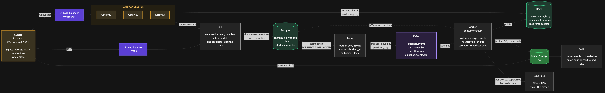
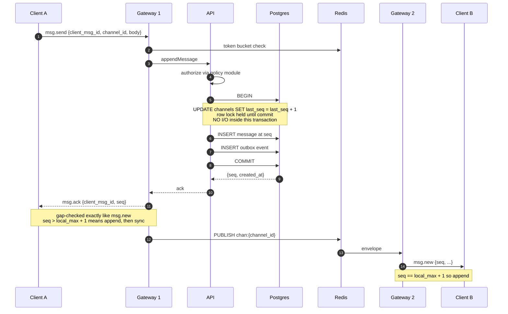
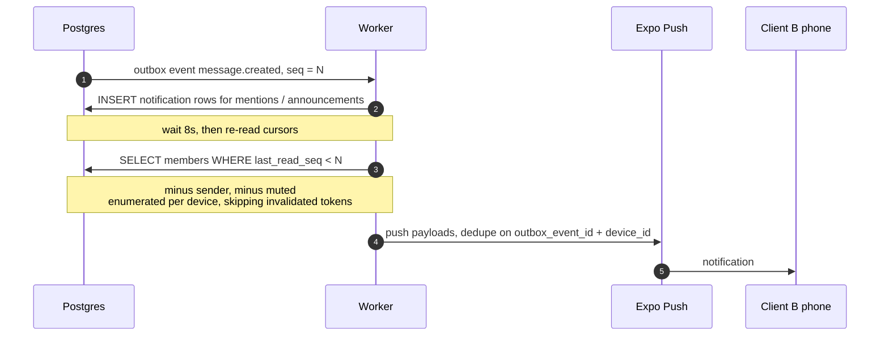
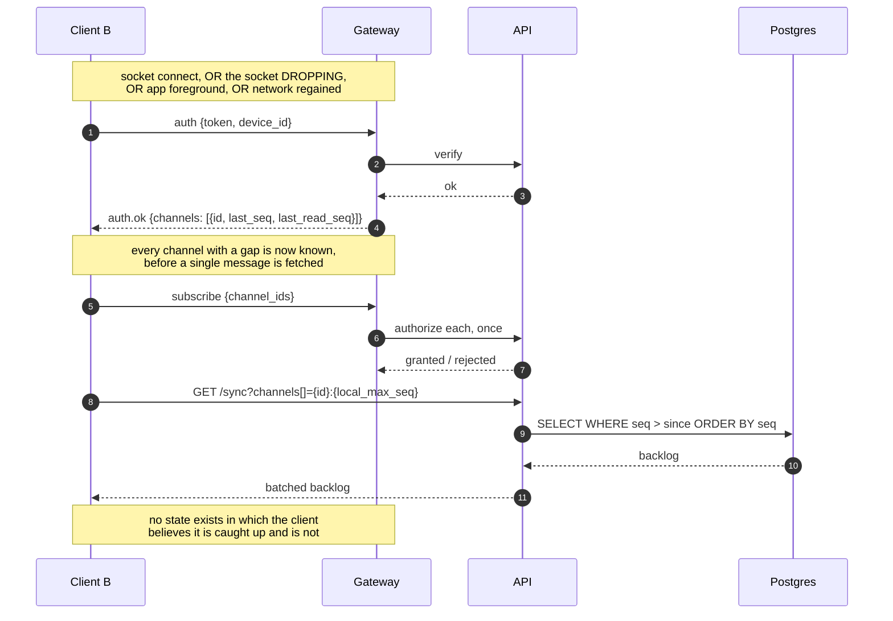
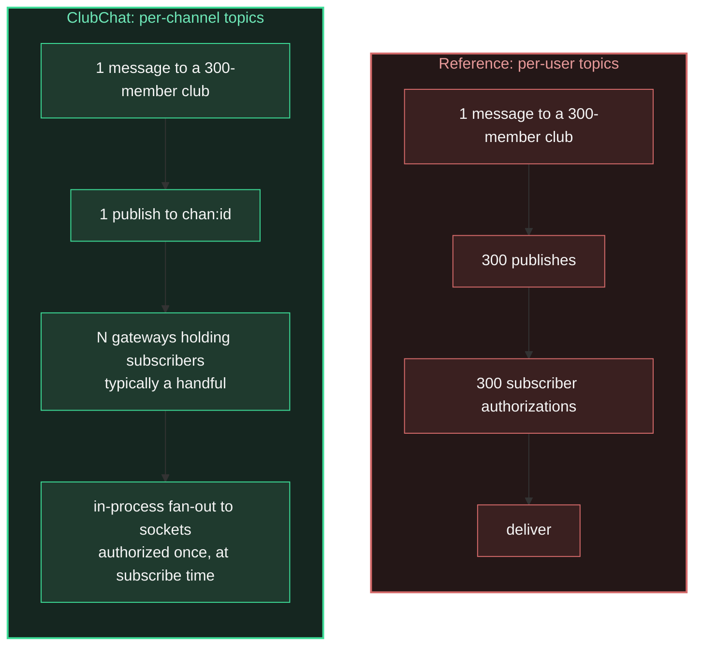
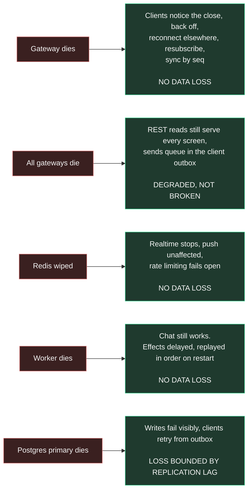

# ClubChat - Architecture Diagrams

Visual annex to the rest of [`SPEC/TECH/`](.). Same rule applies: where a diagram disagrees with the repo,
the repo is right and the diagram is the bug. Fix it in the same change.

Diagrams are Mermaid so they render on GitHub and in most editors, and so a change to the
architecture is a reviewable text diff rather than a re-exported image.

---

## 1. System overview

The same shape as the WhatsApp reference drawing: client on the left, load balancer, a cluster
of connection-holding servers in the middle, and the stores and services fanning out to the
right. What differs is section 2.



> **The Mermaid source below is authoritative; the image above is a generated export** for
> viewers that do not render Mermaid. It goes stale the moment the source changes. Re-export it
> in the **same change** as any edit to this diagram:
>
> ```bash
> ./scripts/render-diagrams.sh     # writes system-overview.png and .svg
> ```
>
> `assets/system-overview.svg` is the same diagram as vector, for zooming without the pixels showing.

```mermaid
flowchart LR
    APP["<b>CLIENT</b><br/>Expo App<br/>iOS / Android / Web<br/><br/>SQLite message cache<br/>send outbox<br/>sync engine"]

    LB4["L4 Load Balancer<br/>WebSocket"]
    LB7["L7 Load Balancer<br/>HTTPS"]

    subgraph GWC["GATEWAY CLUSTER"]
        direction TB
        G1["Gateway"]
        G2["Gateway"]
        G3["Gateway"]
    end

    API["API<br/><br/>command + query handlers<br/>policy module<br/>one predicate, defined once"]
    RELAY["Relay<br/><br/>outbox poll, 250ms<br/>marks published_at<br/>no business logic"]
    KAFKA["Kafka<br/><br/>clubchat.events<br/>partitioned by partition_key<br/>clubchat.events.dlq"]
    WORKER["Worker<br/>consumer group<br/><br/>system messages, cards<br/>notification fan-out<br/>cascades, scheduled jobs"]

    PG[("Postgres<br/><br/>channel log with seq<br/>outbox<br/>all domain tables")]
    REDIS[("Redis<br/><br/>connection registry<br/>per-channel pub/sub<br/>rate limit buckets")]

    BLOB[("Object Storage<br/>R2")]
    CDN["CDN<br/><br/>serves media to the device<br/>on an hour-aligned signed URL"]
    PUSH["Expo Push<br/><br/>APNs / FCM<br/>wakes the device"]

    APP -->|"WebSocket"| LB4
    APP -->|"REST"| LB7
    APP -->|"presigned PUT"| BLOB

    LB4 --> GWC
    LB7 --> API

    GWC -->|"appendMessage"| API
    GWC <-->|"pub/sub chan:id<br/>session registry"| REDIS

    API -->|"domain rows + outbox<br/>one transaction"| PG

    PG -->|"claim batch<br/>FOR UPDATE SKIP LOCKED"| RELAY
    RELAY -->|"produce, keyed by<br/>partition_key"| KAFKA
    KAFKA -->|"consume"| WORKER
    WORKER -.->|"effects written back"| PG
    WORKER -->|"publish"| REDIS
    WORKER -->|"per device, suppressed<br/>by read cursor"| PUSH
    WORKER -->|"orphan GC, thumbnails"| BLOB

    BLOB --> CDN

    classDef client fill:#3a3320,stroke:#d99a2b,stroke-width:3px,color:#f5f5f5
    classDef gateway fill:#3a3320,stroke:#d99a2b,stroke-width:2px,color:#f5f5f5
    classDef lb fill:#5b3fd4,stroke:#7c63ff,color:#ffffff
    classDef store fill:#1f3a2e,stroke:#3ddc97,color:#f5f5f5
    classDef svc fill:#242424,stroke:#9a9a9a,color:#f5f5f5
    classDef blob fill:#2d7a3e,stroke:#4ade80,color:#ffffff

    class APP client
    class G1,G2,G3 gateway
    class LB4,LB7 lb
    class PG,REDIS store
    class API,RELAY,WORKER,PUSH,CDN svc
    class KAFKA bus
    class BLOB blob

    classDef bus fill:#2a1f3d,stroke:#a78bfa,stroke-width:2px,color:#f5f5f5

    style GWC fill:#241f12,stroke:#d99a2b,stroke-width:2px,color:#e8b45a
```



Two arrows the diagram deliberately does not draw, because they are return paths that would
scramble the left-to-right rank: the CDN serves media back to the device, and Expo Push wakes
it. Both are stated in those nodes' labels instead.

---

## 2. How this differs from the reference drawing

Every row here is argued in an ADR under [`SPEC/decisions/`](../decisions/). This table is the
index, not the argument.

| Reference drawing | ClubChat | Why |
|---|---|---|
| Message Queue - Message Storage Service - Message Database, as three components | **Postgres holds the channel log and the outbox; Kafka sits downstream of the outbox** | The outbox is the transactional boundary, because a queue cannot be atomic with the domain write. Kafka then adds durable replay and independent consumers. Not on the send path. [Effects engine](04-effects-engine.md) |
| Per-recipient one-to-one messaging as the primary feature | **Group chat is primary; DMs are a fourth channel scope** | Reversed from a v1 non-goal. Restricted to members who share a club, and obliged to ship with blocking and a report destination. [Channel log](02-channel-log.md) |
| Chat Servers own routing *and* business logic | **Gateway** holds sockets only; **API** holds all logic; **Worker** holds all effects | A gateway can be killed at any instant with zero data loss. That property is load-bearing. [Overview](00-overview.md) |
| User Connection Cache gates delivery *and* notification | **Redis registry routes publishes only** | Liveness is not proof of receipt. A dead phone keeps a registry entry alive and would silently swallow every push in that window. Suppression is the read cursor. [Message flows](03-message-flows.md) |
| Per-user pub/sub channels, one publish per recipient | **Per-channel topics**, one publish per message | Authorizes once at subscribe instead of once per message per recipient. Cost per message is independent of channel size. [Connection layer](01-connection-layer.md) |
| Per-recipient inbox, delete on delivery | **Durable channel log with a monotonic `seq`**, plus per-user read cursors | Durable history is the product. "Deliver what you missed" and "page through history" become the same query. [Channel log](02-channel-log.md) |
| Presence Service | **Deleted** | Presence, typing indicators and read receipts are all out of scope in [Chat](../PRD/05-chat.md). The registry that remains is internal routing only. |
| Notification Service for offline users | **Worker fans out per device**, suppressed by read cursor after an 8s deferral | Push was the single biggest functional gap in v1. It is designed into the fan-out rather than bolted on. [Notifications and push](06-notifications-and-push.md) |
| sent / delivered / read, tracked per recipient | **`sent` only** | Receipts are out of scope, and they were the largest write amplification in the reference design. [Channel log](02-channel-log.md) |
| Blob Storage to CDN, presigned both ways | **Same for upload. Download goes through an authorized redirect** to an hour-aligned signed URL | Private media must never sit on a guessable URL, and a URL that changes per fetch guarantees a cache miss at every layer. [Media pipeline](07-media-pipeline.md) |

---

## 3. Send, all recipients online



The ack is sent the instant the transaction commits, before any fan-out. Sender A's own other
devices receive the message by the same path, since they subscribe to the same channel. There
is no special case for multi-device.

---

## 4. Send, recipients offline

The first half is identical. The message is committed to the channel log regardless of who is
online, and **there is no separate inbox write**.



The 8s deferral exists to lose a race, not to save work: a member with the chat already open
advances their cursor within a few hundred milliseconds, and without the delay the worker could
push to someone actively looking at the message.

---

## 5. Reconnect and foreground sync

This is the fix for [Engineering pitfalls](14-engineering-pitfalls.md) 25, the silent message loss
that had no fix in v1.



**"OR the socket dropping" is the trigger that did not exist until 2026-08-19**, and its absence
made this whole diagram a description of something the client could not do. `onclose` nulled the
socket and returned; the only callers of `reconnect()` were a send retry and the app-foreground
listener, so a socket lost while somebody was reading a screen started none of the sequence
above. `ChatClient` now pings every 30s to keep the socket unreaped and reconnects a dropped one
on its own with backoff, which is what makes the run below true rather than intended. See
[Connection layer](01-connection-layer.md).

---

## 6. Fan-out topology

The red column is the reference design, the green column is ours. The difference is where
authorization happens, and how many publishes a single message costs.



[Roadmap](../PRD/17-roadmap-and-open-questions.md) debt item 2 records the cost of the left-hand
shape in the v1 build: with 200
concurrent users, one message insert cost roughly 200 authorizations, 200 billed messages, and
200 full refetches.

---

## 7. Failure behaviour

What each component's death does. The full table with recovery detail is
[Failure modes](11-failure-modes.md).



The invariant that makes all of this hold: **nothing is acknowledged before it is durable, and
nothing durable is ever only in Redis or only in a gateway's memory.**

> **The first row described client behaviour that did not exist, for two phases.** It read
> "Gateway dies -> clients reconnect elsewhere, sync by seq, NO DATA LOSS", and no client
> reconnected: the socket's `onclose` nulled it and returned. The durable half was always true -
> the channel log holds everything and `/sync` will hand it back - but nothing was going to ask,
> so what actually happened was a member who received no live message until they sent one or
> reopened a chat. This file's own rule is that where a diagram disagrees with the repo the repo
> is right and the diagram is the bug; here the repo has been changed to match the diagram
> instead, which is the other legitimate way to settle it, and the box now names the mechanism
> so the claim can be checked against `packages/client-core/src/chat-client.ts` rather than
> believed.
